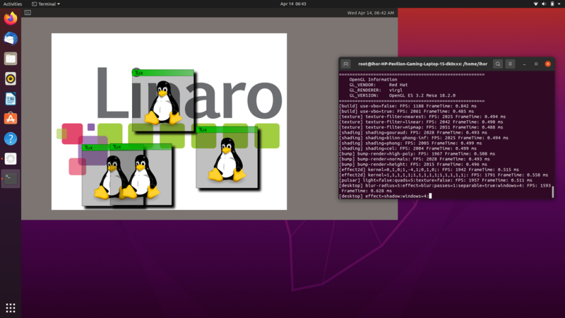

<picture>
<h1 align="center">

</h1>
</picture>

**"Unified HMI" is a common platform technology for UX innovation in integrated cockpit by flexible information display on multiple displays of various applications. Applications can be rendered to any display via a unified virtual display.**
<picture>
<p align="center"></p>
</picture>
<br>

# Remote Virtio GPU Device (RVGPU)

**RVGPU is a client-server based rendering engine, which allows to render 3D on one device (client) and display it via network on another device (server)**

<p align="center"></p>

## Contents

- [Remote Virtio GPU Device (RVGPU)](#remote-virtio-gpu-device-rvgpu)
  - [Contents](#contents)
  - [Repository structure](#repository-structure)
  - [Build instructions](#build-instructions)
  - [Installation instructions](#installation-instructions)
  - [Run RVGPU](#run-rvgpu)
    - [Run `rvgpu-renderer` on Wayland](#run-rvgpu-renderer-on-wayland)
    - [Run `rvgpu-proxy`](#run-rvgpu-proxy)
  - [VSYNC feature](#vsync-feature)
  - [How to run RVGPU remotely](#how-to-run-rvgpu-remotely)
  - [Capsets](#capsets)

## Repository structure

```
.
├── documentation                  # documents
├── include
│    ├── librvgpu                  # librvgpu header files
│    ├── rvgpu-generic             # common header files for all components
│    ├── rvgpu-proxy               # rvgpu-proxy header files
│    ├── rvgpu-renderer            # rvgpu-renderer header files
├── src
│    ├── librvgpu                  # librvgpu source files
│    ├── rvgpu-proxy               # rvgpu-proxy source files
│    ├── rvgpu-renderer            # rvgpu-renderer source files
│    ├── rvgpu-sanity              # sanity module source files
```

## Build instructions

The build instructions described here are tested on Ubuntu 20.04 LTS AMD64.
However you can try it with different Linux distros with Wayland display
server. Assuming, you have a clean Ubuntu 20.04 installed, perform the
following steps:

- Install the build prerequisites

  ```
  sudo apt install cmake pkg-config libvirglrenderer-dev libegl-dev libgles-dev libwayland-dev libgbm-dev libdrm-dev libinput-dev
  ```

- Install the header for `virtio-lo` kernel driver

  Download the `virtio-lo-dev_X.X.deb` development ubuntu package from the latest
  release builds from its github repository:

  [https://github.com/unified-hmi/remote-virtio-gpu-driver/releases/latest](https://github.com/unified-hmi/remote-virtio-gpu-driver/releases/latest)

  And install it:

  ```
  sudo dpkg -i virtio-lo-dev_0.1.deb
  ```

  Alternatively you can just copy the header to `/usr/include/linux`:

  ```
  wget https://github.com/unified-hmi/remote-virtio-gpu-driver/blob/main/virtio_lo_device.h
  sudo cp virtio_lo_device.h /usr/include/linux
  ```

- Build and install remote-virtio-gpu

    ```
    cmake -B build -DCMAKE_BUILD_TYPE=Release
    make -C build
    sudo make install -C build
    ```

## Installation instructions

  To use `remote-virtio-gpu`, you should be able to load the kernel, so turn **Secure Boot** off.

- Install `virtio-lo` kernel module

  Download the `virtio-lo-dkms_X.X_amd64.deb`
  [DKMS](https://en.wikipedia.org/wiki/Dynamic_Kernel_Module_Support)
  ubuntu package from the latest
  release builds from its github repository:

  [https://github.com/unified-hmi/remote-virtio-gpu-driver/releases/latest](https://github.com/unified-hmi/remote-virtio-gpu-driver/releases/latest)

  Then install it:

  ```
  sudo dpkg -i virtio-lo-dkms_0.1_amd64.deb
  sudo apt -f install
  ```

  Here the first command will give an error complaining about unresolved dependencies,
  which you fix with the second one.

  Alternatively you can just follow the build instructions from its repo's README.

  After installation of `virtio-lo` kernel module, load the required modules into kernel:

  ```
  sudo modprobe virtio-lo
  sudo modprobe virtio-gpu
  ```

- Install `remote-virtio-gpu` software

  Download the `remote-virtio-gpu_X.X.deb` ubuntu package from the latest
  release builds from this github repository:

  [https://github.com/unified-hmi/remote-virtio-gpu/releases/latest](https://github.com/unified-hmi/remote-virtio-gpu/releases/latest)

  Then install it:

  ```
  sudo dpkg -i remote-virtio-gpu_0.1.deb
  sudo apt -f install
  ```

  Again, the first command will give an error complaining about unresolved dependencies,
  which you fix with the second one.

  Alternatively you can just follow the build instructions from the section
  [Build instructions](#build-instructions).

## Run RVGPU

RVGPU software consists of client (`rvgpu-proxy`) and server (`rvgpu-renderer`).
Let's describe how to run them on the same machine via the localhost interface.
We will start with `rvgpu-renderer`.

### Run `rvgpu-renderer` on Wayland

`rvgpu-renderer` with Wayland backend creates a window in the Wayland environment
and renders into it.  So you should have a window system supporting Wayland protocol
(such as Gnome with Wayland protocol or Weston) running.
To be sure your window system uses Wayland protocol,
choose [Wayland](https://linuxconfig.org/how-to-enable-disable-wayland-on-ubuntu-20-04-desktop)
on login screen.

Open a terminal and run this command:

```
rvgpu-renderer -b 1280x720@0,0 -p 55667
```

Alternatively, you can launch a dedicated instance of Weston and run `rvgpu-renderer`
inside it.  To do that install `weston`:

```
sudo apt install weston
```

and run this script:

```
export XDG_RUNTIME_DIR=/tmp
weston --width 2200 --height 1200 -S wayland-uhmi &
export WAYLAND_DISPLAY=wayland-uhmi
rvgpu-renderer -b 1280x720@0,0 -p 55667
```

This will create a weston window where `rvgpu-renderer` will create its own
nested subwindow after `rvgpu-proxy` is run.
The script does not require the window system uses Wayland protocol,
so it could be run under X Window system.

### Run `rvgpu-proxy`

`rvgpu-proxy` should be able to access the kernel modules `virtio-lo` and `virtio-gpu`
so it should be run with supersuer privelegies.

```
sudo -i
modprobe virtio-gpu
modprobe virtio-lo

rvgpu-proxy -s 1280x720@0,0 -n 127.0.0.1:55667
```

After you run this, another GPU node `/dev/dri/card1` should appear.
Also, if you are running `rvgpu-renderer` in Wayland mode, it should create 
a new window.

You can test the new gpu node for example running Weston on it:

```
export XDG_RUNTIME_DIR=/tmp
weston --backend drm-backend.so --tty=2 --seat=seat_virtual -i 0
```

After that `rvgpu-renderer` will display _weston_ rendered and transferred
via localhost by `rvgpu-proxy`. Now you can launch `glmark2-es2-wayland` or
some other graphical application to verify that everything works.

## VSYNC feature

`rvgpu-proxy` can emulate VSYNC feature (see the `-f` command option).
To support the VSYNC feature in `rvgpu-proxy`, apply and rebuild the Linux kernel with the following path remote-virtio-gpu/documentation/patches/kernel.
The patches could be applied to the linux kernel with versions before 5.15.
The software still could be compiled or run on the recent kernels without support for VSYNC feature.

Get the Linux kernel souce code, which must be compatible with your Linux distro, use the patch file corresponding with kernel version you get for performing build and generate the necessary deb files

Here, the build instructions described to support the VSYNC feature to the kernel version 5.8.18 for Ubuntu 20.04.

- Get the kernel version 5.8.18 for Ubuntu 20.04.

  ```
  cd /usr/src
  sudo apt-get install -y build-essential libncurses5-dev \
                        gcc libssl-dev grub2 bc bison flex libelf-dev
  sudo wget https://cdn.kernel.org/pub/linux/kernel/v5.x/linux-5.8.18.tar.xz
  sudo tar -xf linux-5.8.18.tar.xz
  cd linux-5.8.18
  patch -p1 < ~/remote-virtio-gpu/documentation/patches/kernel/0001-drm-virtio-Add-VSYNC-support-linux-5-8.patch
  cp /boot/config-5.8.0-50-generic .config # Other versions of config are acceptable
  vim .config # comment this line CONFIG_SYSTEM_TRUSTED_KEYS=""
  make menuconfig # save config
  make -j`nproc` deb-pkg # the -j`nproc` argument sets the build to use as many cpu's as you have
  ```
  
- After that, some deb packages should be under /usr/src directory:

  ```
  linux-headers-5.8.18_5.8.18-1_amd64.deb
  linux-image-5.8.18_5.8.18-1_amd64.deb
  linux-image-5.8.18-dbg_5.8.18-1_amd64.deb
  linux-libc-dev_5.8.18-1_amd64.deb
  ```
  
- Install packages:

  ```
  dpkg –i linux-*.deb
  update-grub
  ```
  
- If there are no problems, restart your PC

- Make sure the Kernel is updated after reboot. Check Kernel version:
  ```
  uname -r
  ```

## How to run RVGPU remotely

The way is almost the same as to run **RVGPU** locally. Launch
`rvgpu-renderer` on one machine and `rvgpu-proxy` with the kernel modules
on the another one, and pass the IP address and port number on which
rvgpu-renderer is listening to `rvgpu-proxy` through `-n` option.

**Note**  
Some graphical applications generate much network traffic. It is recommended to Configure the network to 1Gbps speed.

## Capsets

Sometimes the software does not work because the provided `virgl.capset` file does not specify
the capset of the rendering side.  It may manifest in black window.
In this case:

- Run `rvgpu-renderer` with `-c virgl.capset.new` option.
- Run `rvgpu-proxy` with the the default old capset.
- Kill the proxy and use the capset written by `rvgpu-renderer` for the next invocations of proxy.
